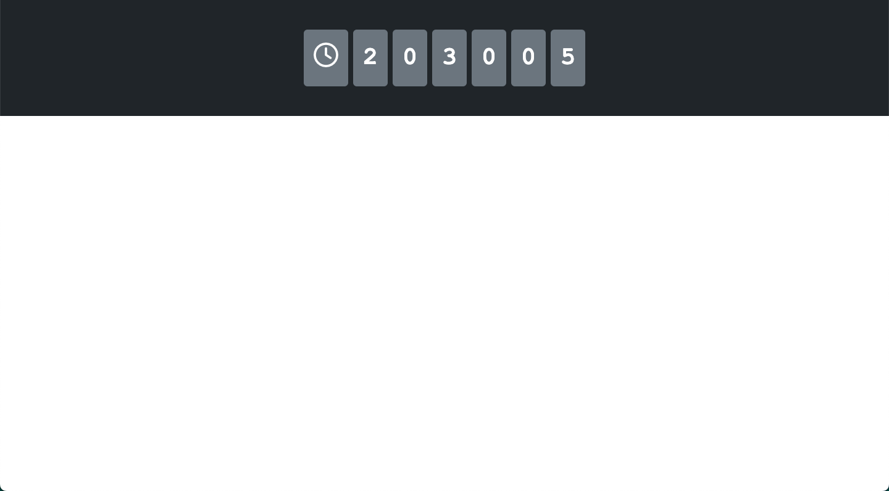

# Simple Counter

## The structure of the project

```
simple-counter
├─ docs
├─ src
│  ├─ img
│  │   └─ favicon.jpeg
│  ├─ js
│  │  ├─ component
│  │  │    ├─ Counter.jsx
│  │  │    └─ Home.jsx
│  │  └─ index.js
│  └─ styles
│      └─ index.css
└─ store
   ├─ js
   ├─ md
   └─ svg

```

## The recipe for success

1.  If we take a look at `index.js`, we will see that, synthetically:

    1.  We will find the _typical_ Reacts `import`s statements.

            import React from "react";
            import ReactDOM from "react-dom";
            import Home from "../js/component/Home.jsx";
            import "../styles/index.css";

    2.  We will find a bunch of variables declared:

            let units = 0;
            let tens = 0;
            let hundreds = 0;
            let thousands = 0;
            let tenThousands = 0;
            let hundredThousands = 0;

    3.  We will see a `setInterval()` function. This function allows to execute a function (parameter 1) every any given amount of time measured in miliseconds (ms) —parameter 2. In this case, two main parts can be identified, each one of which will be executed every 1000 ms (_aka_ 1 second).

        1.  A snippet of pure JavaScript that...

                setInterval(() => {
                    units++;                        //  ... will make `units` increase by one by the second.
                                                        ... and...
                if (units >= 9) {                   //  ... when `units` gets to nine...
                    units = 0;                      //  ... it will be reset to 0...
                    tens++;                         //  ... whereas `tens` will be increased by one.
                }

                if (tens >= 9) {                    //  And it will keep on doing so with `tens`...
                    tens = 0;
                    hundreds++;
                }

                if (hundreds >= 9) {                //  ... `hundreds`
                    hundreds = 0;
                    thousands++;
                }

                if (thousands >= 9) {               //  ... `thousands`
                    thousands = 0;
                    tenThousands++;
                }

                if (tenThousands >= 9) {            //  ... `tenThousands`
                    tenThousands = 0;
                    hundredThousands++;
                }

                if (hundredThousands >= 9) {        //  ... and `hundredThousands`
                    hundredThousands = 0;
                }

        2.  A `ReactDOM.render` method which...

                ReactDOM.render(                                    //  ... will render a WHAT, in this case...
                    <Home                                           //  ... the Component <Home /> with the properties...
                        secondsUnits={units}                        //  ... `secondsUnits`...
                        secondsTens={tens}                          //  ... `secondsTens`...
                        secondsHundreds={hundreds}                  //  ... `secondsHundreds`...
                        secondsThousands={thousands}                //  ... `secondsThousands`...
                        secondsTenThousands={tenThousands}          //  ... `secondsTenThousands`...
                        secondsHundredThousands={hundredThousands}  //  ... and `secondsHundredThousands`...
                    />,
                    document.querySelector("#app")                  //  ... and it will render it "in the WHERE".
                );

                }, 1000);                                           // Once again, every 1000 ms (_aka_ 1 second).

    4.  Now, if `index.js` is calling the Component `<Home />` from `Home.jsx`, let's take a look at it:

            ...

            const Home = (props) => {
                return (
                    <Counter
                        units={props.secondsUnits}
                        tens={props.secondsTens}
                        hundreds={props.secondsHundreds}
                        thousands={props.secondsThousands}
                        tenThousands={props.secondsTenThousands}
                        hundredThousands={props.secondsHundredThousands}
                    />
                );
            };

            ...

        Basically, all that the Component <Home /> does is calling the Component `<Counter />` along the properties:

        -   units
        -   tens
        -   hundreds
        -   thousands
        -   tenThousands
        -   hundredThousands

        Those properties are equated to the `props` object generated when calling the `<Home />` component with its properties from `index.js`. We will understand how properties and values correlate together in this project once we have had a look of the Component `<Counter />` that can be found at `Counter.jsx`.

    5.  `Counter.jsx` contains the definition of the behaviour of the Component `<Counter />`. The most interesting part of this Component is:

            const Counter = (props) => {
                ...
                        <div className="p-3 rounded bg-secondary fs-1 mx-1">
                            {props.hundredThousands}
                        </div>
                ...
            };

        In this case, the object `props` as parameter of the Component `<Counter />` is gonna be searching for the value of a property called `hundredThousands`. And what's the value of `hundredThousands`? For that, we gotta trace our steps back:

        1.  At `Counter.jsx`:

            -   `{props.hundredThousand}` is asking: "What's the value of `hundredThousands`?"

            -   So we go to where `<Counter />` is being called, which is at `Home.jsx`.

        2.  At `Home.jsx`, `<Counter />` is being called with the property `hundredThousands` equated to `{props.secondsHundredThousands}`.

                <Counter
                    ...
                    hundredThousands={props.secondsHundredThousands}
                    ...
                />

            -   Thus, `{props.secondsHundredThousands}` is asking: "What's the value of `secondsHundredThousands`?"

            -   So we go to where `<Home />` is being called, which is at `index.js`.

        3.  At `index.js`, `<Home />` is being called with the property `secondsHundredThousands` equated to `{hundredThousands}`.

                <Home
                    ...
                    secondsHundredThousands={hundredThousands}
                />

            -   Thus, the system asks: "What's the value of `hundredThousands`? And the answer to that question is found at `index.js` itself:

                -   `hundredThousands` starts with a value of `0` when it is first declared:

                        let hundredThousands = 0;

                -   Then, it does increment by one after `units`, `tens`, `hundreds`, `thousands`, and `tenThousands` have been duly incremented according to the behaviour described. This is:

                        units++;

                        if (units >= 9) {
                            units = 0;
                            tens++;
                        }

                        if (tens >= 9) {
                            tens = 0;
                            hundreds++;
                        }

                        if (hundreds >= 9) {
                            hundreds = 0;
                            thousands++;
                        }

                        if (thousands >= 9) {
                            thousands = 0;
                            tenThousands++;
                        }

                        if (tenThousands >= 9) {
                            tenThousands = 0;
                            hundredThousands++;
                        }

                        if (hundredThousands >= 9) {
                            hundredThousands = 0;
                        }

        4.  And so, the final concatenation happens this way:

        | `Counter.jsx`                   | `Home.jsx`                                              | `index.js`                                        | `index.js`                |
        | ------------------------------- | ------------------------------------------------------- | ------------------------------------------------- | ------------------------- |
        | Needs`{props.hundredThousands}` | asks `hundredThousands={props.secondsHundredThousands}` | asks `secondsHundredThousands={hundredThousands}` | finds `hundredThousands`  |
        | Within a Component              | Within the call of `<Counter />`                        | Wwithin the call of `<Home />`}                   | `let hundredThousands= 0` |

## Final result



---

<div style="text-align:center; font-weight:bold;">~ The End ~</div>
